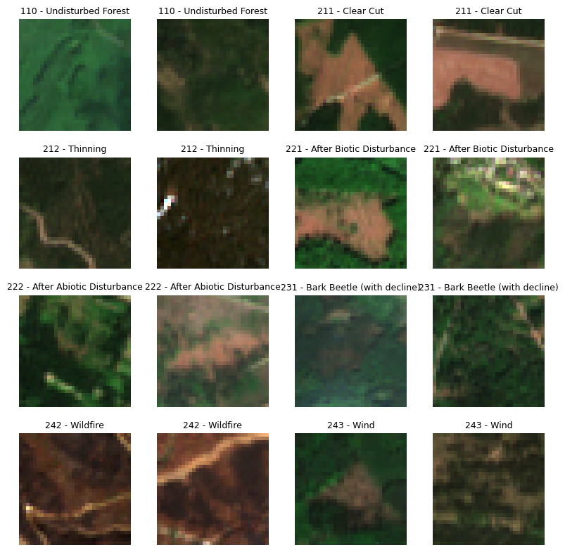

# DISFOR 

**DISFOR** offers dense labelled satellite time-series data on forest disturbance timing and agents of disturbance. It contains 3823 unique time-series. 
Each time-series corresponds to a single 10x10m Sentinel-2 pixel. 

## Installation

The package can be installed from PyPI:

`pip install disfor`

## Usage

The data itself is available at on huggingface: https://huggingface.co/datasets/JR-DIGITAL/DISFOR.
There are detailed usage guides available in the documentation at: https://jr-digital.github.io/DISFOR/usage/dataset-overview/

## Dataset Overview

There are four main parts of this dataset:

- `samples.parquet`: Providing location and metadata of sampled points
- `labels.parquet`: Providing labels for each sampled time-series
- `pixel_data.parquet`: Providing Sentinel-2 band data for each acquistion in the time-series
- Sentinel-2 Chips: Image chip time-series for each sample

### samples.parquet

This contains the sampled points along with metadata on the points. It provides the following columns:

| Column name | Description |
| --- | --- |
| sample_id | Unique sample ID for each sample point |
| original_sample_id | Sample ID of the point in the original publication of the dataset |
| interpreter | Shorthand code for the interpreter who labelled this sample |
| dataset | Number of the original sampling campaign in which this point was labelled |
| source | The ancillary data source used to interpret the agent |
| source_description | A long text description of the used source. Link to the original data if available |
| s2_tile | If available, which Sentinel 2 Tile the sample intersects |
| cluster_id | Unique ID to group samples which are spatio-temporally autocorrelated |
| cluster_description | What type of cluster it is |
| comment | Free text comment about the interpretation of the sampled point |
| confidence | Confidence of sampling: high where both timing and agent are confident, medium were only the timing is confident |
| geometry | Coordinates of the sampled point. In CRS EPSG:4326 |

### labels.parquet

This contains the time-series labels for each sampled point in `samples.parquet`. The following columns are available: 

| Column name | Description |
| --- | --- |
| sample_id | Taken from sample table |
| original_sample_id | Taken from sample table |
| dataset | Taken from sample table |
| label | Interpreted class of the segment (see next table) |
| original_label | The label which was originally assigned and remapped to label |
| start | Start date of the segment |
| end | End date of the segment |
| start_next_label | Start date of the next label. Some labels are encoded as events (Clear Cuts for example) and are not immediately followed by another label, this column allows a full segmentation of the time-series. Null if it is the last label of the sample |

The provided label is a hierarchical label, following this hierarchy:

<table border="1" cellspacing="0" cellpadding="6">
  <thead>
    <tr>
      <th>Level 1</th>
      <th>Level 2</th>
      <th>Level 3</th>
    </tr>
  </thead>
  <tbody>
    <!-- 100 - Alive Vegetation -->
    <tr>
      <td rowspan="4">100 - Healthy Vegetation</td>
      <td>110 - Undisturbed Forest</td>
      <td></td>
    </tr>
    <tr>
      <td rowspan="3">120 - Revegetation</td>
      <td>121 - With Trees (after clear cut)</td>
    </tr>
    <tr>
      <td>122 - Canopy closing (after thinning/defoliation)</td>
    </tr>
    <tr>
      <td>123 - Without Trees (shrubs and grasses, no reforestation visible)</td>
    </tr>
    <tr>
      <td rowspan="14">200 - Disturbed</td>
      <td rowspan="3">210 - Planned</td>
      <td>211 - Clear Cut</td>
    </tr>
    <tr>
      <td>212 - Thinning</td>
    </tr>
    <tr>
      <td>213 - Forestry Mulching (Non Forest Vegetation Removal)</td>
    </tr>
    <tr>
      <td rowspan="2">220 - Salvage</td>
      <td>221 - After Biotic Disturbances</td>
    </tr>
    <tr>
      <td>222 - After Abiotic Disturbances</td>
    </tr>
    <tr>
      <td rowspan="2">230 - Biotic</td>
      <td>231 - Bark Beetle</td>
    </tr>
    <tr>
      <td>232 - Gypsy Moth (temporal segment of visible disturbance)</td>
    </tr>
    <tr>
      <td rowspan="5">240 - Abiotic</td>
      <td>241 - Drought</td>
    </tr>
    <tr>
      <td>242 - Wildfire</td>
    </tr>
    <tr>
      <td>243 - Wind</td>
    </tr>
    <tr>
      <td>244 - Avalanche</td>
    </tr>
    <tr>
      <td>245 - Flood</td>
    </tr>
  </tbody>
</table>

This mapping from label numbers to text is also available in `classes.json`.

### pixel_data.parquet

This dataset provides the Sentinel-2 time-series of spectral values from which the labels were interpreted. The following columns are available:

| Column name | Datatype | Description |
| --- | --- | --- |
| sample_id | UINT16 | Taken from sample table |
| timestamp | DATE | UTC date of the S2 acquisition |
| label | UINT16 | Interpreted class of the segment, see previous table |
| clear | BOOL | True if the pixel is clear (SCL value any of 2,4,5,6) |
| percent_clear_4x4 [8x8, 16x16, 32x32] | UINT8 | The percentage of clear pixels (SCL in 2,4,5,6) within a 4x4, 8x8, 16x16 or 32x32 pixel image chip |
| B02, B03, B04, B05, B06, B07, B08, B8A, B11, B12 | UINT16 | DN value for the spectral band |
| SCL | UINT8 | Sentinel 2 Scene Classification Value |

### Sentinel-2 Chips

The files `disfor-<start-id>-<end-id>.tar.zst` provide tarballs with Sentinel-2 chips for each sample. The chips are of size 32x32px, 
the sampled point is always at `[16,16]`. The available bands are: `B02, B03, B04, B05, B06, B07, B08, B8A, B11, B12`. 
Sentinel-2 bands with a native resolution of 20m (B11, B12) were resampled to 10m using nearest neighbor resampling.

The file structure in each tarball is:

`tiffs/<sample_id>/YYYY-MM-DD.tif`

## Train Test Split

There is a train test split available which was constructed to reduce spatial autocorrelation and information leakage between the sets.
Two JSONs with lists of sample_ids are available in 

- `train_ids.json`
- `val_ids.json`