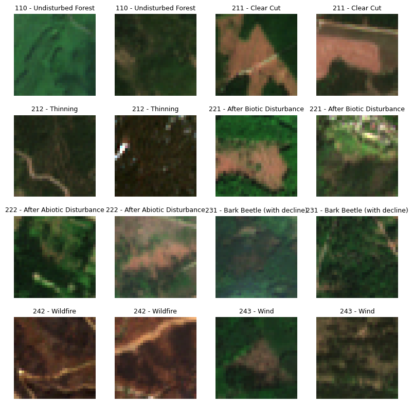

# DISFOR

DISFOR offers dense labelled satellite time-series data on forest disturbance timing and agents of disturbance.

Below are some examples of image chips together with their labels.

This package offers data classes to easily use the labelled data in machine learning tasks.

See the Usage section for a short overview of the provided data and how to use the included data loading utilities.